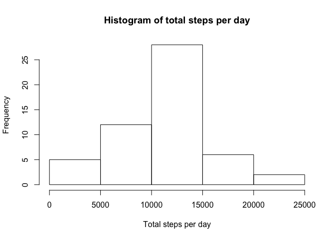

# Reproducible Research: Peer Assessment 1


## Loading and preprocessing the data


```r
setwd("/Users/maria/Projects/RepData_PeerAssessment1")
activity_data<-read.csv("activity.csv")
```
Processing the data. We need to create a separate datetime variable instead of integer variable interval. The interval represents time and it would be wrong to store it as integer. For instance 125 represents 1 hour and 25 min, not 125 min. If we use it for plotting as Integer, not as time, it can potentially skew the plot.


```r
activity_data$t1<-as.character(activity_data$interval)
```
In this part of R code we are going to add zeros to the interval value in such way that time always contains 4 digits.

```r
activity_data$time=paste(sapply(activity_data$t1,function(x) {paste(rep("0",4-nchar(x)),collapse="")}),activity_data$t1,sep="")
```

Loading lubridate for easier handling of dates and creating datetime column by combining date and time

```r
library(lubridate)
activity_data$datetime<-ymd_hms(paste(activity_data$date,activity_data$time,"00"))
```
The date should be also corverted to a date format. It is a factor now.

```r
activity_data$date<-ymd(activity_data$date)
```
Converting time variable to datetime neglecting the date.

```r
activity_data$time <- ymd_hms(paste("20000101",strftime(activity_data$datetime, format="%H:%M:%S")))
```
Downloading dplyr package and defining the data frame as a table in dplyr.

```r
 library(dplyr)
```

```
## 
## Attaching package: 'dplyr'
## 
## The following objects are masked from 'package:lubridate':
## 
##     intersect, setdiff, union
## 
## The following objects are masked from 'package:stats':
## 
##     filter, lag
## 
## The following objects are masked from 'package:base':
## 
##     intersect, setdiff, setequal, union
```

```r
activity_data<-tbl_df(activity_data)
```
Preview the data

```r
str(activity_data)
```

```
## Classes 'tbl_df', 'tbl' and 'data.frame':	17568 obs. of  6 variables:
##  $ steps   : int  NA NA NA NA NA NA NA NA NA NA ...
##  $ date    : POSIXct, format: "2012-10-01" "2012-10-01" ...
##  $ interval: int  0 5 10 15 20 25 30 35 40 45 ...
##  $ t1      : chr  "0" "5" "10" "15" ...
##  $ time    : POSIXct, format: "2000-01-01 02:00:00" "2000-01-01 02:05:00" ...
##  $ datetime: POSIXct, format: "2012-10-01 00:00:00" "2012-10-01 00:05:00" ...
```

## What is mean total number of steps taken per day?
In order to answer this question we need to aggregate the data. Using package dplyr to create an aggregated table.

```r
total_steps_by_day<-summarise(group_by(activity_data,as.character(date)),steps=sum(steps))
```
Building the histogram of the total steps by day

```r
hist(total_steps_by_day$steps,main="Histogram of total steps per day",xlab="Total steps per day")
```

 

Here we will calculate the mean and median for total number of steps

```r
options(scipen=999)
the_mean<-mean(total_steps_by_day$steps,na.rm=TRUE)
the_median<-median(total_steps_by_day$steps,na.rm = TRUE)
```
The mean of total steps by day is 10766.1886792 and the median is 10765

## What is the average daily activity pattern?

First step is to aggregate the data by time interval. We want to see the average number of steps for every 5 minutes. 


```r
average_steps_by_time_interval<-summarise(group_by(activity_data,time),steps=mean(steps,na.rm=TRUE))
```
Now is time to build the plot

```r
plot(average_steps_by_time_interval$time,average_steps_by_time_interval$steps,type="l",main="Average number of steps throughout the day", xlab="Time", ylab="Number of Steps")
```

 

Calculating at what time interval would be achieved the maximum maximum number of steps

```r
best_time_interval<-average_steps_by_time_interval[average_steps_by_time_interval$steps==max(average_steps_by_time_interval$steps),]
best_time<-strftime(best_time_interval$time,format="%H:%M")
best_steps<-round(best_time_interval$steps)
```
The most active time of the day is 11:20 and its average number of steps is 171

## Imputing missing values
Calculate the total number of rows with _NA_.

```r
activity_na<-is.na(activity_data$steps)
num_na_rows<-sum(activity_na)
```

Total number of rows with _NA_ is 2304

Now we have to fill in the gaps.


## Are there differences in activity patterns between weekdays and weekends?
Adding a new variable

```r
 activity_data$day<-ifelse(substr(weekdays(activity_data$datetime),1,1)=="S","weekend","weekday")
```
Aggregating data and building the plot

```r
average_by_weekday<-summarise(group_by(activity_data,interval,day),steps=mean(steps,na.rm=TRUE))
average_weekday<-filter(average_by_weekday,day=="weekday")
average_weekend<-filter(average_by_weekday,day=="weekend")
par(mfrow = c(2, 1))
par(mar = c(4, 4, 0, 0))
plot(average_weekday$interval,average_weekday$steps,type="l",xlab="",ylab="steps")
plot(average_weekend$interval,average_weekend$steps,type="l",xlab="",ylab="steps")
```

 
